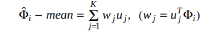

## Face Recognition
Inorder to detect the faces from the given image, we first need get the feature vectors for each image. Although we have the image itself as two dimensional vector, we need something which is simple and in a much lower dimension to compare them easily.

So, we will find the eigen values and eigen vectors of the matrix containing all the images. These eigen vectors are called as Eigen Faces. Each of them represent a feature of an image. Unlike what we think these are not intutive features like face shape, nose structure, color, eyes etc., They are rather counter intutive. We will consider top eigen faces (principal components) and use them for predicting our new image. This complete mathematical dsription is given in the paper mentioned above.

## Implementation

Every Two dimensional Image can be represented as 3 dimensional matrix with the three channels being Red, Blue and Green. We need to convert this 3d matrix into a 2d matrix by converting the image to grayscale. Grayscale can be roughly considered as an average of these three channels. Although, in order to convert it into a better looking grayscale image we need to take ```gray_scale = ((0.3 * R) + (0.59 * G) + (0.11 * B))```

Once we get a grayscale image(2d matrix). In order to represent all the images in the form of a single matrix. We will flatten them and then combine them into a single matrix.

Gray Scale Image in the Dataset,


Before we actually flatten and combine them, we need to take the average of all the images and subtract the original image from the average image.

Average Image look like this, 


After Subtracting the average from the original image it look like this.


Now, Find the Covariance Matrix of this matrix containing all the images using the below formula.


**Note**: If we try to find the eigen values of the matrix using the above we will find it very difficult considering our computational resources. Hence, we will find the eigen values and vectors(vi) for Transpose(A)*A
And then we can get eigen vectors of the required matrix using the below formula.

 

The obtained eigenfaces look like this,


Once we obtain the eigen faces take top eigenfaces and get the weights of each image in dataset using the below formula.


Once we obtain all the images we just need to return the class of the image nearest to the test image. We can use any distance metric like euclidean distance.

## Results

For the reults, the dataset is divided into 70% as training data and 30% as test data. We have 15 different images with 11 images each with slightly varying facial expressions and lighting conditions.

 - Test Accuracy - 100%
 - F1 Score - 
 - Confusion matrix, 


Correctly Classified Test Images,


Misclassified Test Images


